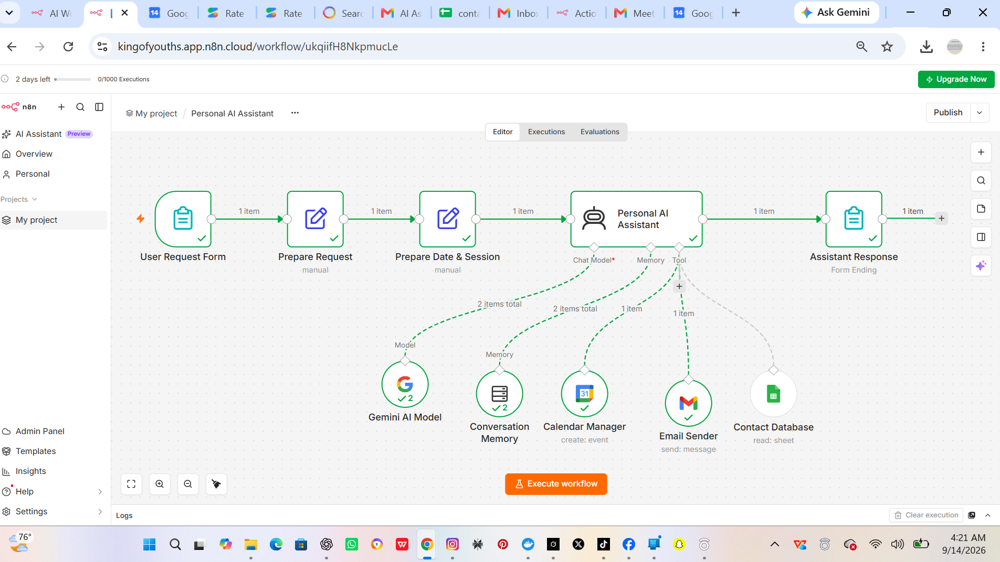
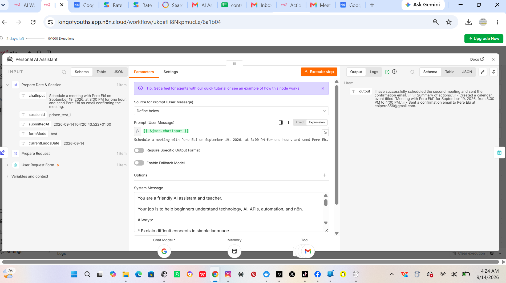
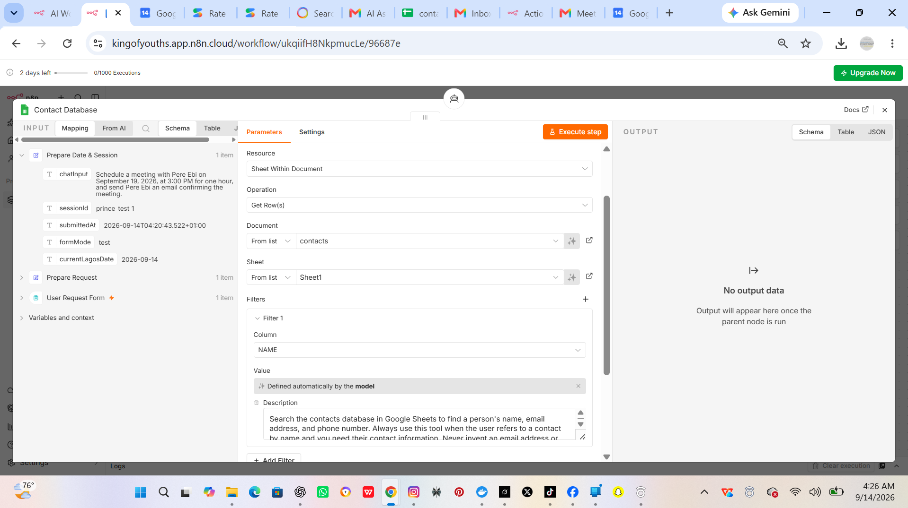
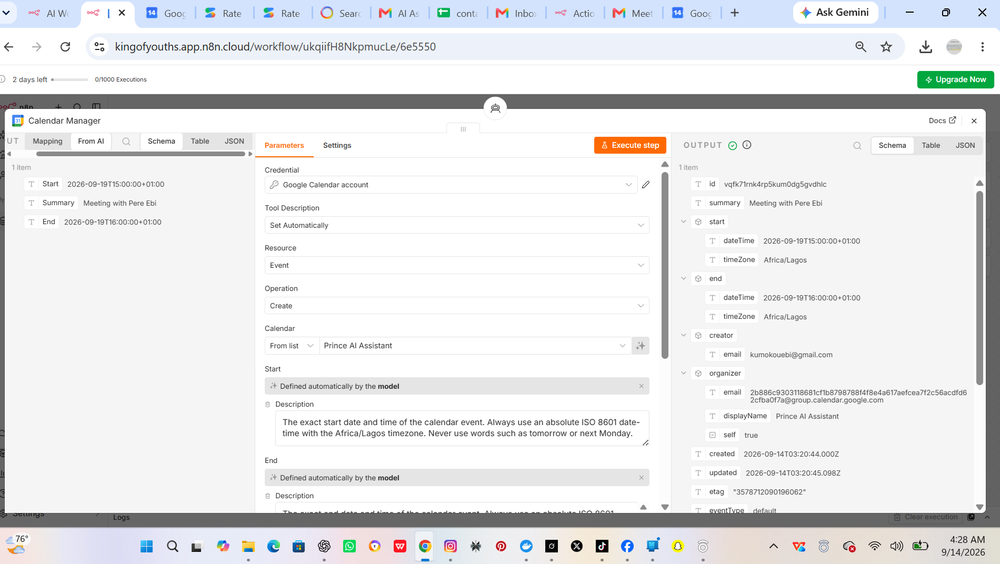
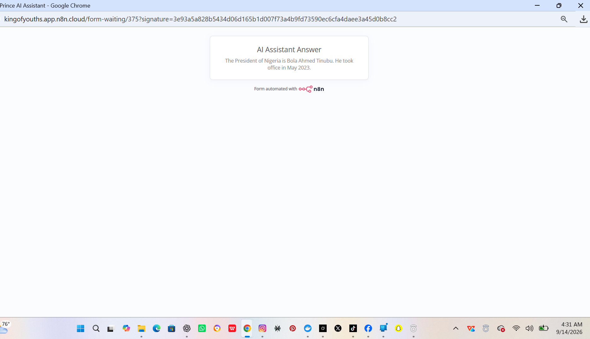

# Personal AI Assistant — n8n

An AI-powered personal assistant built with n8n, Google Gemini, Google Sheets, Google Calendar, and Gmail.

The assistant can answer questions, remember conversations, search a contact database, create calendar events, and send emails through automated tool execution.

## Project Overview

This project demonstrates how an AI agent can connect to external services and perform useful real-world tasks through n8n.

The assistant is designed to help with AI, automation, APIs, and n8n questions while also performing actions such as:

* Maintaining conversation memory
* Searching a Google Sheets contact database
* Creating Google Calendar events
* Sending Gmail messages
* Handling dates using the Africa/Lagos timezone
* Executing tools without unnecessary duplicate actions

## Workflow

User Request Form
↓
Prepare Request
↓
Prepare Date & Session
↓
Personal AI Assistant
↓
Assistant Response

The AI Agent is connected to:

* Google Gemini AI Model
* Conversation Memory
* Contact Database
* Calendar Manager
* Email Sender

## Technologies Used

* n8n
* Google Gemini
* Google Sheets
* Google Calendar
* Gmail
* APIs
* Webhooks
* JSON
* AI Agents
* Workflow Automation

## Key Features

### AI Assistant

The assistant uses Google Gemini to understand user questions and provide beginner-friendly explanations about AI, automation, APIs, and n8n.

### Conversation Memory

The assistant uses a session ID to maintain conversation context between messages.

### Contact Database

Before sending an email to a named contact, the assistant searches the Google Sheets contact database for the person's email address.

The assistant does not invent email addresses when a contact cannot be found.

### Google Calendar

The assistant can create calendar events using the Africa/Lagos timezone and converts relative dates into absolute ISO 8601 date and time values.

### Gmail

The assistant can send emails automatically when the required contact information is available.

## Testing

The workflow was tested for:

* Basic AI responses
* Conversation memory
* Contact database searches
* Google Calendar event creation
* Gmail email sending
* Missing contact handling
* Autonomous tool execution
* Relative date handling
* Africa/Lagos timezone handling

## Screenshots

### Full Workflow

### AI Agent

### Contact Database

### Calendar + Gmail Execution

### Working Assistant

## Future Improvements

Planned improvements include:

* WhatsApp integration
* Supabase database integration
* Web search
* Document and knowledge-base integration
* More automation tools
* Improved error handling
* Deployment and monitoring improvements

## Project Status

Version 1 — Completed

This project is part of my journey into AI Automation Engineering, focusing on building practical AI agents and business automation systems with n8n.
